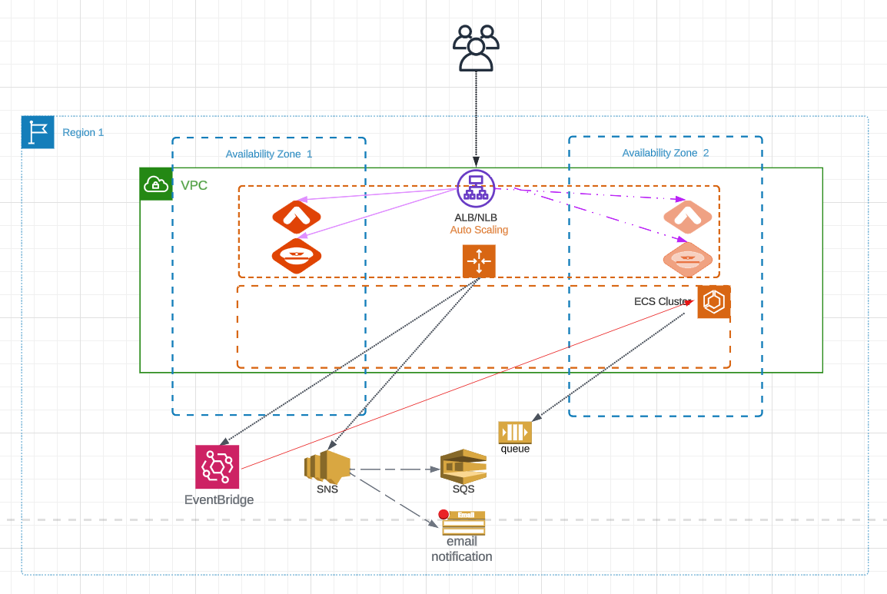
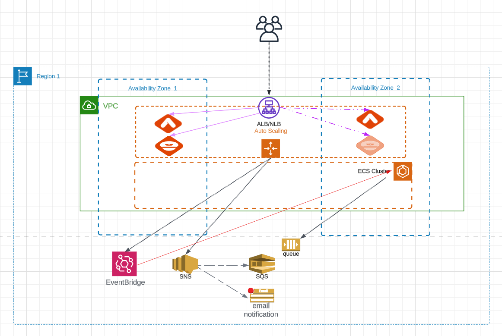
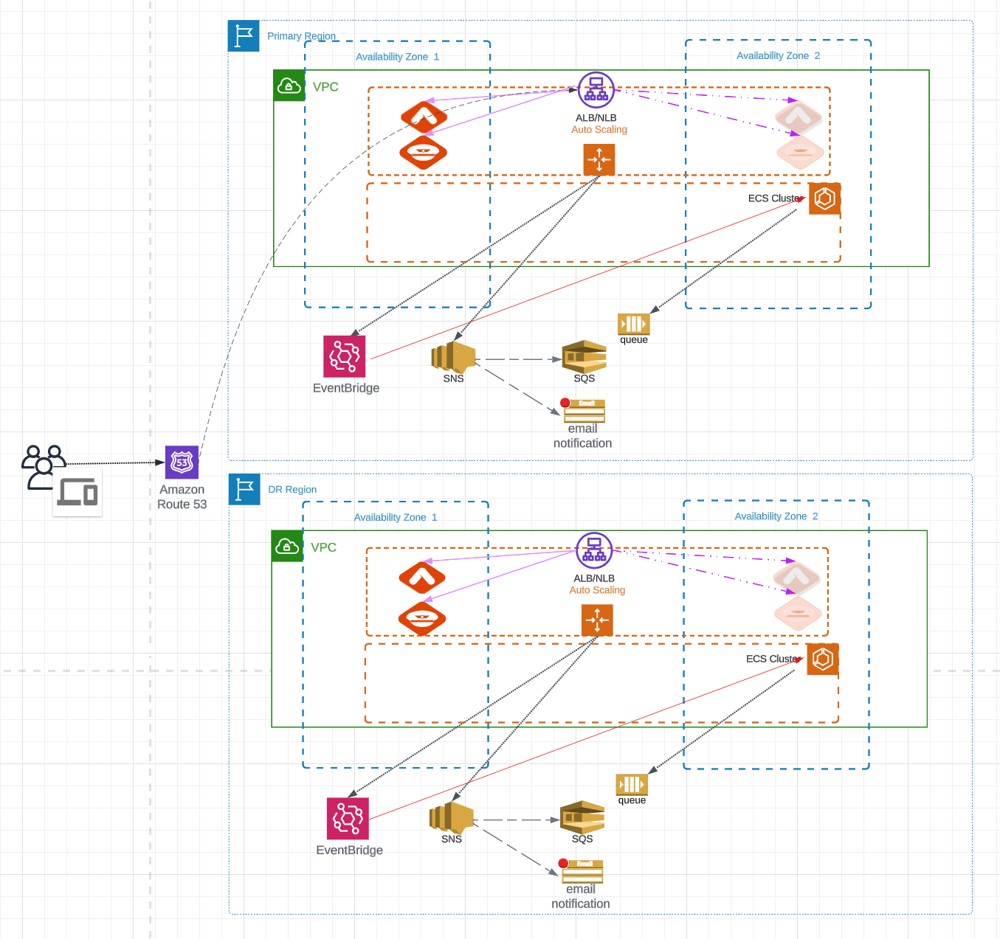

## Aviatrix with High Availability

### Goals

- Ensure that Aviatrix Controller and CoPilot are always deployed with high availability
- Optionally support a hot standby Controller instance which reduces Controller switchover time to under a minute

### Description

This Terraform module will create the following:

- An Auto Scaling Group (ASG) for Aviatrix Controller
  - The Controller will be initialized to the specified version (latest by default) and Controller backups will be configured.
- An Auto Scaling Group (ASG) for Aviatrix CoPilot
- An AWS load balancer with the Controller and CoPilot instances as targets
- An Elastic Container Service (ECS) cluster and task definition. ECS handles Controller and CoPilot failover events and restores the configuration from the latest backup automatically on new instances.
- An Amazon EventBridge event rule that monitors events from the ASGs and invokes ECS.
- An Amazon Simple Notification Service (SNS) topic that receives events from the ASGs.
- An Amazon Simple Queue Service (SQS) queue that is subscribed to the SNS topic. When EventBridge triggers ECS, ECS reads messages from the SQS queue and takes the appropriate actions.
- Additional roles for the resources above with corresponding role policies with required permissions
- If `ha_distribution` is set to "inter-region":
  - The resources listed above will also be deployed in a second region
  - A Route 53 record specified by `record_name` will be created in the zone specified by `zone_name`

### Controller Version Support

Aviatrix Platform HA supports controllers running version 7.0 and later

### Prerequisites

The following resources should be created before running Terraform. The module will not create these resources.

- The S3 bucket used for Controller backups
- The Key Pair to be used by the Launch Templates in the Auto Scaling Groups
- The admin password required to initilaize the Controller should be set in the AWS Systems Manager parameter store at /aviatrix/controller/password in us-east-1.

  `aws ssm put-parameter --type "SecureString" --name "/aviatrix/controller/password" --value "XXXXXXXXX" --region="us-east-1"`

  For non-production deployments, the password can be specified by `avx_password`. This is not recommended for production because the password will be viewable in the container's environment variables.

- The customer ID required to license the Controller should be set in the AWS Systems Manager parameter store at /aviatrix/controller/customer_id in us-east-1.

  `aws ssm put-parameter --type "SecureString" --name "/aviatrix/controller/customer_id" --value "XXXXXXXXX" --region="us-east-1"`

  For non-production deployments, the customer ID can be specified by `avx_customer_id`. This is not recommended for production because the customer ID will be viewable in the container's environment variables.

- For CoPilot initialization, if a specific service account is used, and the `copilot_username` and `copilot_email` variables are provided, then the service account password should be set in the AWS Systems Manager parameter store. The path for the password may be provided via the `avx_copilot_password_ssm_path` variable, or the default path `/aviatrix/copilot/password` will be checked. The password should be stored in the region defined in the `avx_password_ssm_region` variable. Otherwise, the default region of `us-east-1` will be checked. If service account information is not provided via the `copilot_username` and the `copilot_email` variables, then the default `admin` account on the controller will be used as the service account to initialize the CoPilot.

  `aws ssm put-parameter --type "SecureString" --name "/aviatrix/copilot/password" --value "XXXXXXXXX" --region="us-east-1"`

  For non-production deployments, if the `copilot_username` and the `copilot_email` variables are provided for the service account, the password for the service account can be specified by `avx_copilot_password`. This is not recommended for production because the password will be viewable in the container's environment variables.

- If `ha_distribution` is set to "inter-region", the hosted zone specified by `zone_name` must already exist in Route 53.

- Boto3 should be [installed](https://boto3.amazonaws.com/v1/documentation/api/latest/guide/quickstart.html#installation) and authentication for AWS should be [configured](https://boto3.amazonaws.com/v1/documentation/api/latest/guide/quickstart.html#configuration) so that helper Python scripts can run on `terraform destroy`. The following privileges are required to run the scripts:
  - ecs:ListTasks
  - ecs:StopTask
  - ec2:DescribeSecurityGroups
  - ec2:DeleteSecurityGroup

### Usage Example

#### Single-AZ

```
module "aws_controller_ha" {
  source                      = "github.com/aviatrix-automation/Aviatrix_AWS_HA"
  incoming_ssl_cidr           = ["x.x.x.x/32"]
  copilot_incoming_https_cidr = ["x.x.x.x/32"]
  access_account_name         = "AWS-Account"
  admin_email                 = "admin@example.com"
}
```



#### Inter-AZ

```
module "aws_controller_ha" {
  source                      = "github.com/aviatrix-automation/Aviatrix_AWS_HA"
  incoming_ssl_cidr           = ["x.x.x.x/32"]
  copilot_incoming_https_cidr = ["x.x.x.x/32"]
  access_account_name         = "AWS-Account"
  admin_email                 = "admin@example.com"
  ha_distribution             = "inter-az"
}
```



#### Inter-Region

```
module "aws_controller_ha" {
  source                      = "github.com/aviatrix-automation/Aviatrix_AWS_HA"
  incoming_ssl_cidr           = ["x.x.x.x/32"]
  copilot_incoming_https_cidr = ["x.x.x.x/32"]
  access_account_name         = "AWS-Account"
  admin_email                 = "admin@example.com"
  ha_distribution             = "inter-region"
  zone_name                   = "example.com"
  record_name                 = "controller.example.com"
  inter_region_backup_enabled = true
}
```



#### China Deployment

```
module "aws_controller_ha" {
  source                      = "github.com/aviatrix-automation/Aviatrix_AWS_HA"
  incoming_ssl_cidr           = ["x.x.x.x/32"]
  copilot_incoming_https_cidr = ["x.x.x.x/32"]
  access_account_name         = "AWS-Account"
  admin_email                 = "admin@example.com"
  ha_distribution             = "inter-az"
  region                      = "cn-north-1"
  dr_region                   = "cn-northwest-1" //dr region in china must be specified, either in single-az or inter-az case
  avx_customer_id_ssm_region  = "cn-north-1"
  avx_password_ssm_region     = "cn-north-1"
}
```

### Health Checks

The Auto Scaling Groups use both EC2 and Elastic Load Balancing health checks to check whether the Controller and CoPilot instances are healthy.

- For [EC2 health checks](https://docs.aws.amazon.com/autoscaling/ec2/userguide/ec2-auto-scaling-health-checks.html#instance-health-detection), the instance is considered unhealthy if it is in any state other than `running`. This includes when the instance has any of the following states:
  - `stopping`
  - `stopped`
  - `shutting-down`
  - `terminated`
- For [Elastic Load Balancing health checks](https://docs.aws.amazon.com/autoscaling/ec2/userguide/ec2-auto-scaling-health-checks.html#elastic-load-balancing-health-checks), the instance is considered unhealthy when the following health check fails:
  - Protocol: TCP
  - Port: 443
  - Unhealthy threshold: 2
  - Timeout: 10 seconds
  - Interval: 30 seconds

### Interactions Between Components

- When the Auto Scaling Group (ASG) determines that an EC2 instance is unhealthy, the ASG launches a new replacement instance and terminates the unhealthy instance.
- A Simple Notification Service (SNS) topic is configured as the notification target of the ASG. When there is a new EC2 instance launched, SNS is notified of this event. There are two subscriptions to this SNS topic:
  - The email address specified in `asg_notif_email` - The user will be notified by email when there is an instance launched.
  - A Simple Queue Service (SQS) queue - The event will be stored as a message in the SQS queue to be retrieved when the container launches and the HA code is run.
- An EventBridge rule looks for `EC2_INSTANCE_LAUNCHING` events from the Controller and CoPilot Auto Scaling Groups. If there is a matching event, the Elastic Container Service (ECS) target is notified to take action.
- The ECS cluster runs a task that launches a container using the latest image from the container registry. The HA code in the container reads the message from the SQS queue and takes the appropriate action depending on what the event is (e.g. upgrades the Controller and restores the latest backup).

### Brownfield Deployment

#### Aviatrix Controller

To deploy Aviatrix Platform HA with an existing Controller, perform the following steps:

1. Perform a [Controller backup](https://docs.aviatrix.com/documentation/latest/platform-administration/controller-backup-restore.html#backing-up-your-configuration).
2. In AWS, go to the S3 bucket where the backup was saved to and sort the files by the date last modified. There will be two recent files with a `.enc` extension. Note the filename for the file with the date/time stamp in it (e.g. `CloudN_10.0.0.39_save_cloudx_config_20230706164329.enc`)
3. Deploy the new Aviatrix Platform HA solution.
4. If the [previous HA solution](https://github.com/AviatrixSystems/Controller-HA-for-AWS/) was used, [disable Controller High Availability](https://docs.aviatrix.com/documentation/latest/platform-administration/controller-ha-aws.html#disabling-aws-controller-high-availability) by deleting the CloudFormation stack.
5. Terminate the previous Controller instance.
6. Perform a [Controller restore](https://docs.aviatrix.com/documentation/latest/platform-administration/controller-backup-restore.html#restoring-your-configuration) using the file noted in step 2.

#### Aviatrix CoPilot

1. Perform a [CoPilot Configuration Backup](https://docs.aviatrix.com/copilot/latest/platform-administration/copilot-backup-configuration.html#backup-copilot-configuration). This will store the CoPilot configuration on the current, active controller.
2. Optionally, perform a [CoPilot Index Data Backup](https://docs.aviatrix.com/copilot/latest/platform-administration/copilot-backup-index.html)
3. Deploy the new Aviatrix Platform HA solution, and restore the controller configuration as described in the previous section. This will restore the controller configuration from the previously active controller (with the saved CoPilot configuration), into the new active controller, managed by the AWS Platform HA solution.
4. Manually trigger an HA event for the new CoPilot instance launched by AWS Platform HA, by stopping the VM. A new CoPilot VM will be launched, and its configuration will be restored from the saved CoPilot configuration on the controller

### Logging and Email Notifications

- Logs can be viewed in CloudWatch in the `/aws/ecs/avx_platform_ha` log group.
- Email alerts from the Aviatrix Controller will be sent to the address specified in `admin_email`.
- Auto Scaling group events will be sent to the address specified in `asg_notif_email` only if you confirm the subscription. Upon `terraform apply`, AWS will send an email asking to confirm the subscription. If deploying `inter-region`, you will need to confirm both emails that are received.

### Variables

| Key                              | Default Value                           | Description                                                                                                                                                                                                                                    |
| -------------------------------- | --------------------------------------- | ---------------------------------------------------------------------------------------------------------------------------------------------------------------------------------------------------------------------------------------------- |
| access_account_name              |                                         | A friendly name mapping to your AWS account ID                                                                                                                                                                                                 |
| admin_email                      |                                         | The administrator's email address. This email address will be used for password recovery as well as for notifications from the Controller.                                                                                                     |
| alb_cert_arn                     | ""                                      | The ARN of the ACM certificate to use with the application load balancer in the primary region. Required if `load_balancer_type` is `application`.                                                                                             |
| asg_notif_email                  | admin_email                             | The email address for Controller failover notifications. This will default to the admin_email if not specified.                                                                                                                                |
| app_role_max_session_duration    | 43200 seconds (12 hours)                | The max session duration for the Aviatrix App role                                                                                                                                                                                             |
| app_role_name                    | aviatrix-role-app                       | The name of the Aviatrix App role                                                                                                                                                                                                              |
| avx_copilot_password             |                                         | The Aviatrix Copilot service account password. WARNING: The password will be visible in the container's environment variables. See above note for more information.                                                                            |
| avx_copilot_password_ssm_path    | /aviatrix/copilot/password              | The path to the Aviatrix CoPilot password                                                                                                                                                                                                      |
| avx_customer_id                  |                                         | The Aviatrix customer ID. WARNING: The Customer ID will be viewable in the container's environment variables. It is recommended to store the customer ID in an SSM parameter and to not use `avx_customer_id` for production deployments.      |
| avx_customer_id_ssm_path         | /aviatrix/controller/customer_id        | The path to the Aviatrix customer ID. Only applicable if `avx_customer_id` is not specified.                                                                                                                                                   |
| avx_customer_id_ssm_region       | us-east-1                               | The region the customer ID parameter is in. Only applicable if `avx_customer_id` is not specified.                                                                                                                                             |
| avx_password                     |                                         | The Aviatrix Controller admin password. WARNING: The password will be viewable in the container's environment variables. It is recommended to store the password in an SSM parameter and to not use `avx_password` for production deployments. |
| avx_password_ssm_path            | /aviatrix/controller/password           | The path to the Aviatrix password. Only applicable if `avx_password` is not specified.                                                                                                                                                         |
| avx_password_ssm_region          | us-east-1                               | The region the password parameter is in. Only applicable if `avx_password` is not specified.                                                                                                                                                   |
| configure_waf                    | false                                   | Whether AWS WAF is enabled for the Controller access.                                                                                                                                                                                          |
| controller_ami_id                | ""                                      | The Aviatrix Controller AMI ID                                                                                                                                                                                                                 |
| controller_ha_enabled            | true                                    | Whether HA is enabled for the Controller. Set to `false` to temporarily disable HA                                                                                                                                                             |
| controller_name                  |                                         | Name of Controller.                                                                                                                                                                                                                            |
| controller_version               | "latest"                                | The initial version of the Aviatrix Controller at launch                                                                                                                                                                                       |
| copilot_ami_id                   | ""                                      | The Aviatrix Copilot AMI ID                                                                                                                                                                                                                    |
| copilot_default_data_volume_size | 8GB                                     | Default data volume disk size for CoPilot                                                                                                                                                                                                      |
| copilot_default_data_volume_type | gp3                                     | Default data volume type for CoPilot                                                                                                                                                                                                           |
| copilot_deployment               | simple                                  | The CoPilot deployment type. Valid values are `simple` and `fault-tolerant`. `fault-tolerant` is only supported if `ha_distribution` is `single-az` or `inter-az`.                                                                             |
| copilot_email                    |                                         | CoPilot account email. See Prerequisites above for more information                                                                                                                                                                            |
| copilot_ha_enabled               | true                                    | Whether HA is enabled for CoPilot. Set to `false` to temporarily disable HA.                                                                                                                                                                   |
| copilot_incoming_https_cidr      | CoPilot HTTPS access                    | CoPilot allowed CIDRs for HTTPS acccess                                                                                                                                                                                                        |
| copilot_incoming_netflow_cidr    | CoPilot Netflow (UDP port 31283) access | CoPilot allowed CIDRs for Netflow acccess                                                                                                                                                                                                      |
| copilot_incoming_syslog_cidr     | CoPilot Syslog (UDP port 5000) access   | CoPilot allowed CIDRs for Syslog acccess                                                                                                                                                                                                       |
| copilot_instance_type            | t3.2xlarge                              | CoPilot instance size                                                                                                                                                                                                                          |
| copilot_name                     |                                         | Name of CoPilot                                                                                                                                                                                                                                |
| copilot_root_volume_size         | 25GB                                    | Root volume disk size for CoPilot                                                                                                                                                                                                              |
| copilot_root_volume_type         | gp3                                     | Root volume type for CoPilot                                                                                                                                                                                                                   |
| copilot_type                     | Copilot                                 | Type of billing, can be 'Copilot' or 'CopilotARM'                                                                                                                                                                                              |
| copilot_username                 |                                         | CoPilot account username. See Prerequisites above for more information                                                                                                                                                                         |
| create_iam_roles                 | true                                    | Whether to create the IAM roles used to grant AWS API permissions to the Aviatrix Controller                                                                                                                                                   |
| dr_alb_cert_arn                  | ""                                      | The ARN of the ACM certificate to use with the application load balancer in the DR region. Required if `load_balancer_type` is `application`.                                                                                                  |
| dr_controller_ami_id             | ""                                      | The DR Aviatrix Controller AMI ID                                                                                                                                                                                                              |
| dr_copilot_ami_id                | ""                                      | The DR Aviatrix Copilot AMI ID                                                                                                                                                                                                                 |
| dr_keypair                       | ""                                      | Key pair which should be used by DR Controller. Only applicable if `ha_distribution` is "inter-region".                                                                                                                                        |
| dr_region                        | "us-east-2"                             | Region to deploy the DR Controller. Only applicable if `ha_distribution` is "inter-region".                                                                                                                                                    |
| dr_subnet_ids                    |                                         | The list of existing subnets to deploy the Controller in. Only applicable if `use_existing_vpc` is true.                                                                                                                                       |
| dr_vpc                           | ""                                      | VPC to deploy DR Controlller. Only applicable if `use_existing_vpc` is true. Only applicable if `ha_distribution` is "inter-region".                                                                                                           |
| dr_vpc_cidr                      | 10.0.0.0/24                             | The CIDR for the VPC to create for the DR Controller. Only applicable if `ha_distribution` is "inter-region" and `use_existing_vpc` is false.                                                                                                  |
| dr_vpc_name                      | ""                                      | The name for the VPC to create for the DR Controller. Only applicable if `ha_distribution` is "inter-region" and `use_existing_vpc` is false.                                                                                                  |
| ebs_optimized                    | false                                   | Whether EBS optimization is enabled. Applies to both the Controller and CoPilot.                                                                                                                                                               |
| ec2_role_name                    | aviatrix-role-ec2                       | The name of the Aviatrix EC2 role                                                                                                                                                                                                              |
| existing_copilot_dr_eip          | ""                                      | The existing EIP to use for the DR CoPilot. The EIP must already be allocated in the AWS account. Only applicable if `use_existing_copilot_eip` is true.                                                                                       |
| existing_copilot_eip             | ""                                      | The existing EIP to use for CoPilot. The EIP must already be allocated in the AWS account. Only applicable if `use_existing_copilot_eip` is true.                                                                                              |
| existing_dr_eip                  | ""                                      | The existing EIP to use for the DR Controller. The EIP must already be allocated in the AWS account. Only applicable if `use_existing_eip` is true.                                                                                            |
| existing_eip                     | ""                                      | The existing EIP to use for the Controller. The EIP must already be allocated in the AWS account. Only applicable if `use_existing_eip` is true.                                                                                               |
| ha_distribution                  | single-az                               | Desired Controller high availability distribution. Valid values are 'single-az', 'inter-az', and 'inter-region'.                                                                                                                               |
| incoming_ssl_cidr                |                                         | Incoming CIDR for security group used by Controller                                                                                                                                                                                            |
| instance_type                    | t3.xlarge                               | Controller instance size                                                                                                                                                                                                                       |
| inter_region_backup_enabled      | false                                   | Whether to enable backups on the primary controller. Only applicable if `ha_distribution` is "inter-region".                                                                                                                                   |
| keypair                          |                                         | Key pair which should be used by Controller                                                                                                                                                                                                    |
| license_type                     | BYOL                                    | Type of billing, can be 'MeteredPlatinum', 'BYOL' or 'Custom'                                                                                                                                                                                  |
| load_balancer_type               | network                                 | Type of load balancer, can be `network` or `application`                                                                                                                                                                                       |
| monitoring                       | false                                   | Whether detailed monitoring is enabled. Applies both to the Controller and CoPilot.                                                                                                                                                            |
| name_prefix                      | avx                                     | Additional name prefix for resources created by this module                                                                                                                                                                                    |
| private_zone                     | false                                   | Set to ` true` if Route 53 zone is private type                                                                                                                                                                                                |
| record_name                      | true                                    | The record name to be created under the exisitng route 53 zone specified by `zone_name`. Required if `ha_distribution` is 'inter-region'.                                                                                                      |
| region                           | "us-east-1"                             | Region to deploy the Controller and CoPilot                                                                                                                                                                                                    |
| root_volume_size                 | 64                                      | Root volume disk size for Controller                                                                                                                                                                                                           |
| root_volume_type                 | gp3                                     | Root volume type for Controller                                                                                                                                                                                                                |
| s3_backup_bucket                 | aviatrix-ha-                            | If `use_existing_s3` is false, a new S3 bucket will be created with the prefix specified by `s3_backup_bucket`. If `use_existing_s3` is true, the S3 bucket must already be created.                                                           |
| s3_backup_region                 | us-east-1                               | The region the S3 backup bucket is in                                                                                                                                                                                                          |
| standby_instance_state           | Running                                 | Instance state in Warm Pool of AWS autoscaling group. Valid values are `Running` and `Stopped`                                                                                                                                                 |
| subnet_ids                       |                                         | The list of existing subnets to deploy the Controller in. Only applicable if `use_existing_vpc` is true.                                                                                                                                       |
| subnet_name                      | Aviatrix-Public-Subnet                  | The subnet name to create for the Controller. Only applicable if `use_existing_vpc` is false.                                                                                                                                                  |
| tags                             | {}                                      | Map of common tags which should be used for module resources. Example: `{ key1 = "value1", key2 = "value2" }`                                                                                                                                  |
| termination_protection           | true                                    | Whether to enable termination protection on the Controller and CoPilot instances                                                                                                                                                               |
| use_existing_copilot_eip         | false                                   | Set to true to use the EIP(s) specified by `existing_copilot_eip` (and `existing_copilot_dr_eip`) for the Aviatrix CoPilot(s) rather than allocating new EIPs                                                                                  |
| use_existing_eip                 | false                                   | Set to true to use the EIP(s) specified by `existing_eip` (and `existing_dr_eip`) for the Aviatrix Controller(s) rather than allocating new EIPs                                                                                               |
| use_existing_keypair             | false                                   | If `use_existing_keypair` is false, a new keypair will be created with the name specified by `keypair`. If `use_existing_keypair` is true, they keypair must already be created.                                                               |
| use_existing_s3                  | false                                   | Whether to use an existing S3 bucket                                                                                                                                                                                                           |
| use_existing_vpc                 | false                                   | Set to true to deploy Controller and CoPilot to existing VPCs specified by `vpc` and `dr_vpc`.                                                                                                                                                 |
| vpc                              | ""                                      | VPC to deploy Controlller and CoPilot in. Only applicable if `use_existing_vpc` is true.                                                                                                                                                       |
| vpc_cidr                         | 10.0.0.0/24                             | The CIDR for the VPC to create for the Controller. Only applicable if `use_existing_vpc` is false.                                                                                                                                             |
| vpc_name                         | Aviatrix-VPC                            | The name for the VPC to create for the Controller. Only applicable if `use_existing_vpc` is false.                                                                                                                                             |
| waf_managed_rules                | Various free AWS Managed Rules          | Managed rules to apply to WAF. Only applicable if `configure_waf` is true                                                                                                                                                                      |
| zone_name                        | true                                    | The existing Route 53 zone to create a record in. Required if `ha_distribution` is 'inter-region'.                                                                                                                                             |

### Additional Information

When an SNS HA event is triggered there are 3 scenarios depending on what `autoscaling_source` and `autoscaling_destination` are set to:

1. When `autoscaling_source = EC2` and `autoscaling_destination = AutoScalingGroup`:

   - Assigns the EIP created through terraform to the new Controller.
   - Run initial setup and boot to latest version.
   - Set admin email and password.
   - Create primary AWS account.
   - Setup S3 backup.
   - Update environment variables in Lambda which will be used by next event.

2. When `autoscaling_source = EC2` and `autoscaling_destination = WarmPool`:

   - Update Name tag to indicate standby Controller.
   - Run initial setup and boot to specific version parsed from DB backup.

3. When `autoscaling_source = WarmPool` and `autoscaling_destination = AutoScalingGroup`:

   - Update Name tag to indicate standby instance is now active.
   - Assign the EIP to the new Controller.
   - Login and create temp AWS account.
   - Restore configuration from backup.
   - Update environment variables in Lambda.

## CloudFormation

### Description

Aviatrix Platform HA for AWS is also available via CloudFormation. Users can create, update, and delete the Platform HA infrastructure using the provided . All of the functionalities available via Terraform are similarly available via CloudFormation.

### Flow

The CloudFormation stack will gather the input parameters from the user, and then provision the HA infrastructure using a Codebuild instance, which is managed by a Lambda function. Along with a Codebuild project, a Lambda function, the CloudFormation stack will also create an S3 bucket, several SSM parameters to save output values, as well as necessary IAM roles and policies.

### Deployment

To create the HA infrastructure using CloudFormation:

1. Create a stack using the provided 
2. Provide the required inputs, as required by the selected HA deployment
3. Review the inputs, and create the stack

### Troubleshooting and inspection

There are several different resources avaiable for deeper inspection of the CloudFormation deployment status

- CloudFormation stack `Events` tab will have information regarding the CloudFormation resources, and the stack status
- Cloudwatch will have the following Log streams:
  - Log stream for the Lambda function
  - Log stream for the Codebuild project (sourced from the Codebuild project)
  - Log stream for the Aviatrix Platform HA (assuming provisioning is able to start correctly)
- Along with its own logs (which are also shown in the corresponding Log stream), the Codebuild project will also have details regarding the different variables used to provision the Aviatrix Platform HA

### Caveats

- In `inter-az` and `inter-region` deployments, if there is an HA event on the primary Controller, it will successfully failover to the standby Controller. A new standby Controller is deployed and will take approximately 15 minutes to initialize. If there is another HA event with the new primary Controller during this 15 minute window, the subsequent failover will not succeed because the new standby Controller has not been fully initialized.

#### HA in an inter-region deplyoment - Controller ONLY

- In the case of an HA event occurring only for the Controller in an inter-region HA deployment, the CoPilot does NOT automatically switch over to the secondary region. The CoPilot uses its associated Controller to authenticate all requests, and currently, there is no way change the Controller IP that is used for authentication. In an inter-region HA event for the Controller, the Controller IP will change, between the primary and the secondary Controllers. However, the CoPilot will continue to reach out to the primary Controller IP. Currently, the only way to resolve this is to force a CoPilot failover manually. A log message will be printed to show that a Controller HA event has occurred, but the CoPilot has not been restarted recently, and users are asked to verify the connectivity. Users will have **1 hour** after the Controller HA event to trigger CoPilot HA.
- In summary, in the case where only the Controller HA event occurs in an inter-region HA deployment, customers wlll have to manually trigger CoPilot HA within **1 hour** by stopping the CoPilot VM from the AWS Console.

#### HA in an inter-region deplyoment - CoPilot ONLY

- In the case of an HA event occurring only for the CoPilot in an inter-region HA deployment, neither the Controller nor the CoPilot automatically switches over to the secondary region. Since CoPilot is currently mostly used for monitoring and the Controller is used for management, we did not want to force an unneeded Controller failover. So, in this case, a log message will be printed to show that a CoPilot HA event was detected an inter-region deployment, but the Controller was not restarted recently. The new CoPilot will be initialized in the same region.
- In summary, in the case where only the CoPilot HA event occurs in an inter-region HA deployment, the new CoPilot will be initialized in the same region as the working Controller.

#### HA in an inter-region deplyoment - Controller AND CoPilot

- In this case of an HA event occurring for both the Controller and the CoPilot in an inter-region HA deployment, both the Controller and the CoPilot will restored in the DR region. This case assumes a regional outage, because both the Controller and the CoPilot have an HA event.

#### Private Mode Support

- Private-mode with controller HA is supported 7.1 onwards.
- Inter-region HA is not supported with private-mode.
- Controller has to be launched with a public IP address.

### Temporarily Disabling HA

HA can be temporarily disabled if needed. This can be done via Terraform or by directly modifying the Auto Scaling Groups.

Disable HA using Terraform:

- Set `controller_ha_enabled` and/or `copilot_ha_enabled` to false.
- Run `terraform apply`.

Enable HA using Terraform:

- Set `controller_ha_enabled` and/or `copilot_ha_enabled` to true.
- Run `terraform apply`.

Disable HA by updating the Auto Scaling Group(s):

- Go to EC2 -> Auto Scaling -> Auto Scaling Groups.
- Select the Auto Scaling Group (avtx_controller or avtx_copilot).
- Go to Advanced configurations -> Edit.
- Click on Suspended processes and check the following processes:
  - Launch
  - Terminate
  - HealthCheck
  - Replace Unhealthy
- Click on Update to save the changes.
- Repeat this process for the other Auto Scaling Group if necessary.

Enable HA by updating the Auto Scaling Group(s):

- Go to EC2 -> Auto Scaling -> Auto Scaling Groups.
- Select the Auto Scaling Group (avtx_controller or avtx_copilot).
- Go to Advanced configurations -> Edit.
- Under Suspended processes, remove the following processes:
  - Launch
  - Terminate
  - HealthCheck
  - Replace Unhealthy
- Click on Update to save the changes.
- Repeat this process for the other Auto Scaling Group if necessary.

### Warm Pool instance state of AWS Autoscaling Group

The instance state in the AWS ASG Warm Pool is configurable, but it is only supported in the Inter-AZ use case. If the instance state is modified after deployment, the new change will only be effective after a failover.

### WAF Support for Aviatrix Controller

A web application firewall (WAF) can be enabled for additional protection for the Aviatrix Controller. The requirements to use WAF are:

- The load balancer type must be an application load balancer. Network load balancers are not supported. `load_balancer_type` should be set to `application`
- A signed certificate in AWS Certificate Manager is required for ALB. Ensure that the certificate's status is `Issued` in AWS Certificate Manager.

There are 2 main WAF deployment scenarios:

- Default WAF rules
- Customized WAF rules

#### Using the Default WAF Rules

If `configure_waf` is set to `true`, the following AWS Managed Rules are enabled:

- AWS Managed Rules - Common Ruleset
- AWS Managed Rules - Known Bad Inputs Ruleset
- AWS Managed Rules - Amazon IP Reputation List
- AWS Managed Rules - Anonymous IP List
- AWS Managed Rules - SQLite Ruleset
- AWS Managed Rules - Linux Ruleset
- AWS Managed Rules - Unix Ruleset

Configure `waf_managed_rules` to customize the list of managed rules to implement.

##### WAF deployment with basic rules

```
module "aws_controller_ha" {
  source                      = "github.com/aviatrix-automation/Aviatrix_AWS_HA"
  incoming_ssl_cidr           = ["x.x.x.x/32"]
  copilot_incoming_https_cidr = ["x.x.x.x/32"]
  access_account_name         = "AWS-Account"
  admin_email                 = "admin@example.com"
  ha_distribution             = "inter-az"
  load_balancer_type          = "application"
  alb_cert_arn                = "arn:aws:acm:us-east-1:111111111111:certificate/aaaaaaaa-bbbb-cccc-dddd-eeeeeeeeeeee"
  configure_waf               = true
}
```

#### Customized WAF use case

By default, the module will implement the set of AWS Managed Rules listed above. Further customization is possible.

##### WAF deployment with basic rules and extended rules

If you want to add additional rules to the AWS Managed Rules:

- Refer the module's output parameter `alb_arn`.
- Create additional `aws_wafv2_web_acl` resources.
- Associate the `aws_wafv2_web_acl` with the `alb_arn` using a `aws_wafv2_web_acl_association` resource.

```
module "aws_controller_ha" {
  source                      = "github.com/aviatrix-automation/Aviatrix_AWS_HA"
  incoming_ssl_cidr           = ["x.x.x.x/32"]
  copilot_incoming_https_cidr = ["x.x.x.x/32"]
  access_account_name         = "AWS-Account"
  admin_email                 = "admin@example.com"
  ha_distribution             = "inter-az"
  load_balancer_type          = "application"
  alb_cert_arn                = "arn:aws:acm:us-east-1:111111111111:certificate/aaaaaaaa-bbbb-cccc-dddd-eeeeeeeeeeee"
  configure_waf               = true
}

resource "aws_wafv2_web_acl" "example" {
  name        = "example-acl"
  description = "Example ACL"
  scope       = "REGIONAL" # Use CLOUDFRONT for CloudFront distributions
  --- rules omitted ---
}

resource "aws_wafv2_web_acl_association" "associate_alb" {
  resource_arn = module.aws_controller_ha.lb_arn
  web_acl_arn  = aws_wafv2_web_acl.example.arn
}
```

#### WAF deployment with basic rules disabled

If you don't want to use the AWS Managed Rules and would like to fully customize the WAF rules:

- Set `configure_waf` to `false`.
- Refer the module's output parameter `alb_arn`.
- Create additional `aws_wafv2_web_acl` resources.
- Associate the `aws_wafv2_web_acl` resources with the `alb_arn` using a `aws_wafv2_web_acl_association` resource.

```
module "aws_controller_ha" {
  source                      = "github.com/aviatrix-automation/Aviatrix_AWS_HA"
  incoming_ssl_cidr           = ["x.x.x.x/32"]
  copilot_incoming_https_cidr = ["x.x.x.x/32"]
  access_account_name         = "AWS-Account"
  admin_email                 = "admin@example.com"
  ha_distribution             = "inter-az"
  load_balancer_type          = "application"
  alb_cert_arn                = "arn:aws:acm:us-east-1:111111111111:certificate/aaaaaaaa-bbbb-cccc-dddd-eeeeeeeeeeee"
  configure_waf               = false
}

resource "aws_wafv2_web_acl" "example" {
  name        = "example-acl"
  description = "Example ACL"
  scope       = "REGIONAL" # Use CLOUDFRONT for CloudFront distributions
  --- rules omitted ---
}

resource "aws_wafv2_web_acl_association" "associate_alb" {
  resource_arn = module.aws_controller_ha.lb_arn
  web_acl_arn  = aws_wafv2_web_acl.example.arn
}
```
